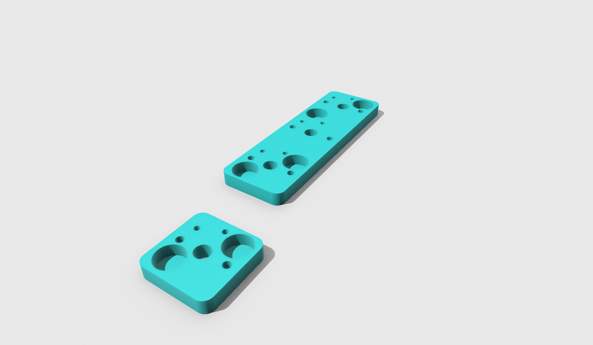
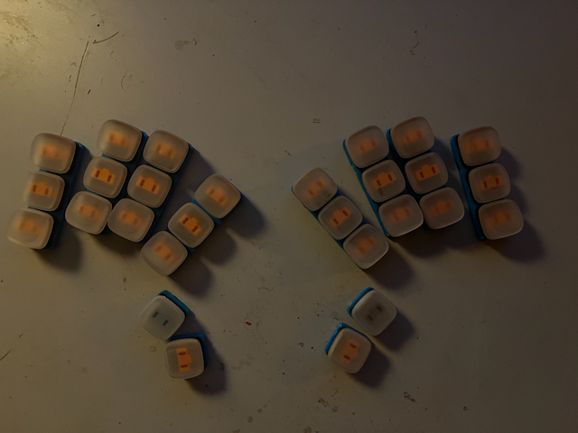
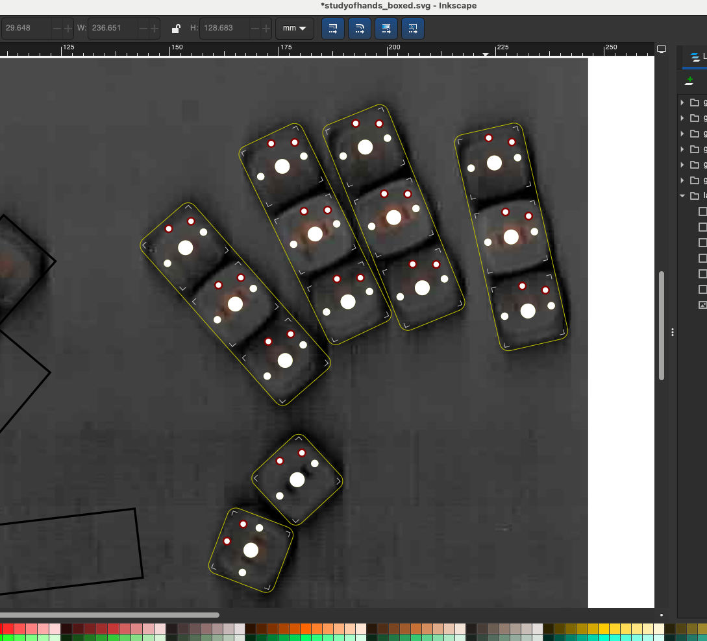
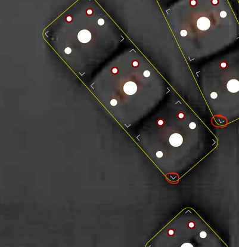
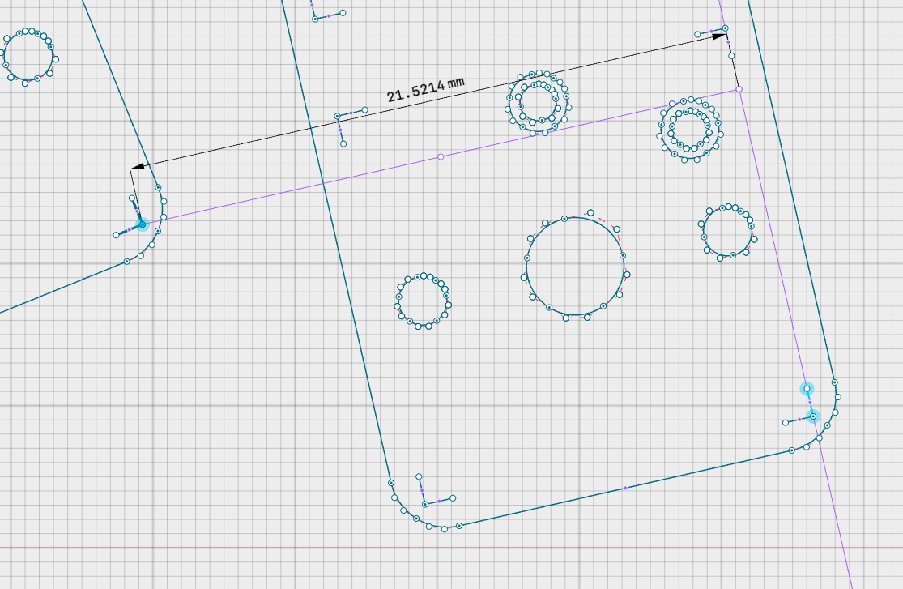
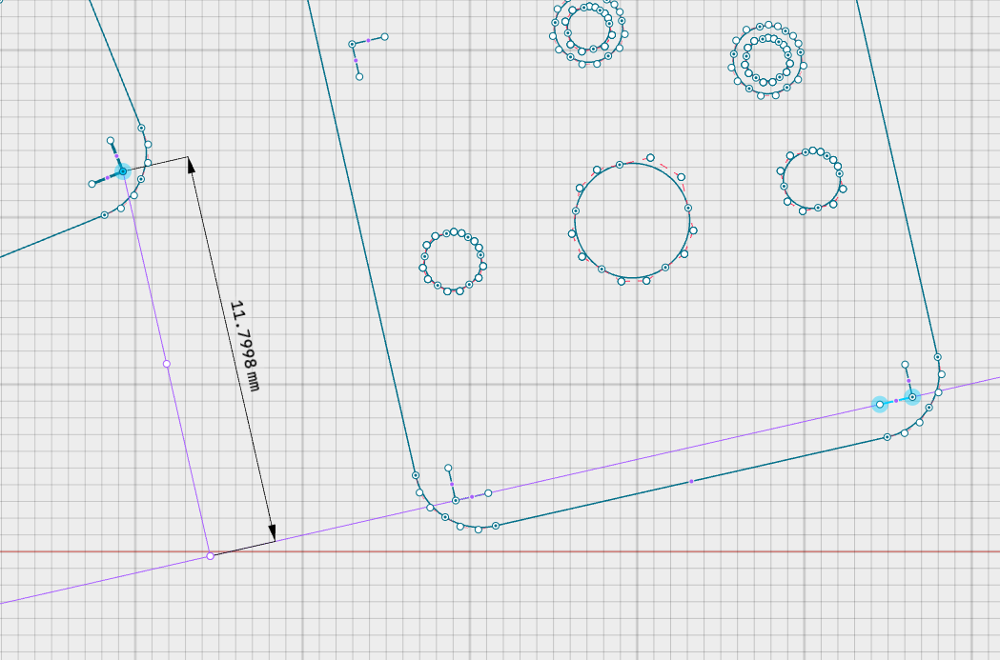
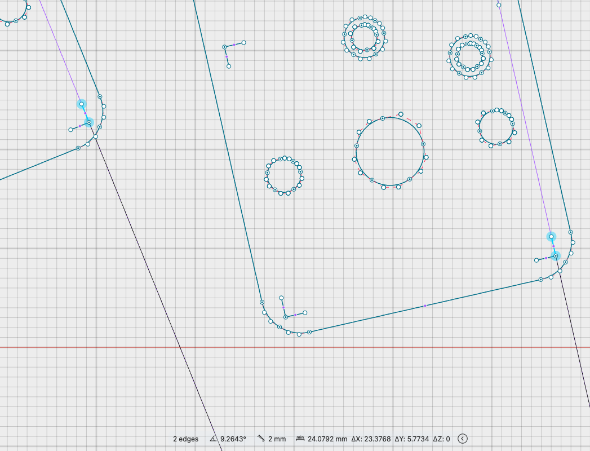

# Study Of Hands

> Find your optimal column placement.

## Instructions

Print as many columns/thumbs as you plan to use in your board (col.stl & thumb.stl). 
Poplate them with 6x3mm round magnets, switches, and keycaps. If you find your switches aren't fitting well, it may be a good time to calibrate your [extra inner](https://www.youtube.com/watch?v=1O-Ho47rwLY) settings.

It's preferable to use the keycaps you plan on using on the final board.
Type on it for a bit, and push and shove till it feels real good.

Scan and scale your board in your favorite cad app (shapr3d works well), then import the col and thumb svgs from this project.

Move and rotate the svgs over the keys. 

Draw a vertical line beside the pinky column and measure the angle between the two. Double this value for your angle between halves (for monoblocks).

Measuring from the switch outline,

 Use your cad package's measure tool to find the spread, stagger, and splay from one column to the next, inputting the numbers in your ergogen config.

### Spread

### Stagger

### Splay

##

It could be interesting to put an mcu on each column and have a really modular board...

